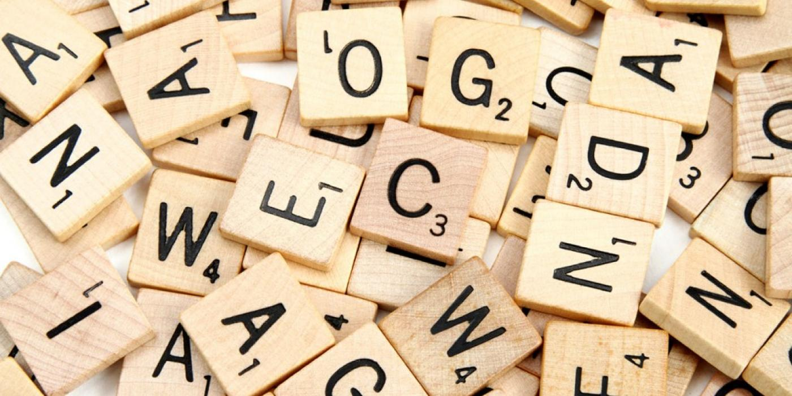

# Monta Palavras 🔠

---
<a href='#description'>Sobre o problema</a>|
<a href='#steps'>Passos para execução</a>|
<a href='#rules'>Regras </a>|
<a href='#values'>Valor das letras </a>|
<a href='#bank'>Banco de palavras </a>|
<a href='#examples'>Exemplos de entradas e saídas</a>|

## 
📝 Sobre o problema 

Considere um jogo de formar palavras. Neste jogo, cada jogador recebe um conjunto de letras e deve decidir qual palavra formada com aquelas letras vai contabilizar a maior quantidade de pontos.

Pense nas letras que são disponibilizadas para cada jogador como "pecinhas" de um jogo, ou seja, pode haver letras repetidas. Além disso, cada letra possui um valor, que ajuda a contabilizar mais pontos na palavra que o jogador formar. 

Para formar uma palavra, todas as letras que a compõem devem estar presentes no conjunto de entrada. Em contrapartida, nem todas as letras disponíveis precisam ser usadas. Por exemplo, se você possui as letras "ybttaaa", você pode formar a palavra "batata", deixando de fora a letra "y".

## 
 🐾 Passos para execução 

Sua tarefa é implementar um programa que lide com uma jogada do jogo de Montar Palavras, sempre fazendo a melhor jogada possível.

Para isso você deve:

- Disponibilizar um campo de entrada no qual será informado quais letras estão disponíveis para que a palavra seja formada.

- Mostrar qual é a palavra de maior pontuação, juntamente com qual pontuação foi obtida.

- Mostrar quais letras não foram utilizadas para formar a melhor palavra. - Tratar quaisquer caracteres especiais como letras não usadas ("pecinhas" que sobraram).

Exemplo:

> /*

> A lógica do programa se baseia em percorrer (...)

> A contagem dos pontos é feita no momento em que (...) */

---

## 
 ⚠ Regras 

- O valor de cada letra é fixo e informado abaixo.

- O banco de palavras também é fixo e informado abaixo. Considere que não existem palavras que não estejam no banco.

- O valor da palavra corresponde à soma dos valores de cada letra que a compõem. O valor das letras que não foram utilizadas para formar a palavra não é descontado no processo.

- Em caso de empate no valor de duas palavras, a palavra mais curta deverá ser escolhida. Exemplo: "nada" (5 pontos) e "meu" (também 5 pontos) => a palavra "meu" deverá ser escolhida

- Se ainda assim houver empate, a palavra que vem primeiro em uma organização alfabética deve ser escolhida. Exemplo: "nada" (5 pontos) e "lado" (também 5 pontos) => a palavra “lado” deverá ser escolhida.

- Desconsiderar acentos e diferenças entre letras maiúsculas e minúsculas. 

---

## 
🧮 Valor das letras 

- 1 ponto: E, A, I, O, N, R, T, L, S, U
- 2 pontos: D, G
- 3 pontos: B, C, M, P
- 5 pontos: F, H, V
- 8 pontos: J, X
- 13 pontos: Q, Z

---

## 
🗃 Banco de palavras

"ABACAXI", "MANADA", "MANDAR", "PORTA", "MESA", "DADO", "MANGAS", "JÁ", "COISAS", "RADIOGRAFIA", "MATEMÁTICA", "DROGAS", "PRÉDIOS", "IMPLEMENTAÇÃO", "COMPUTADOR", "BALÃO", "XÍCARA", "TÉDIO", "FAIXA", "LIVRO", "DEIXAR", "SUPERIOR", "PROFISSÃO", "REUNIÃO", "PRÉDIOS", "MONTANHA", "BOTÂNICA", "BANHEIRO", "CAIXAS", "XINGAMENTO", "INFESTAÇÃO", "CUPIM", "PREMIADA", "EMPANADA", "RATOS", "RUÍDO", "ANTECEDENTE", "EMPRESA", "EMISSÁRIO", "FOLGA", "FRATURA", "GOIABA", "GRATUITO", "HÍDRICO", "HOMEM", "JANTAR", "JOGOS", "MONTAGEM", "MANUAL", "NUVEM", "NEVE", "OPERAÇÃO", "ONTEM", "PATO", "PÉ", "VIAGEM", "QUEIJO", "QUARTO", "QUINTAL", "SOLTO", "ROTA", "SELVA", "TATUAGEM", "TIGRE", "UVA", "ÚLTIMO", "VITUPÉRIO", "VOLTAGEM", "ZANGADO", "ZOMBARIA", "DOR"

---

## 
📋 Exemplos de entradas e saídas

Você deve ler as letras de entrada a partir da entrada padrão e imprimir seu resultado seguindo o formato:

- Exemplo com palavra encontrada e letras sobrando:

> Digite as letras disponíveis nesta jogada: yibttaaa

> BATATA, palavra de 8 pontos

> Sobraram: I, Y

- Exemplo com palavra encontrada sem sobra de letras:

> Digite as letras disponíveis nesta jogada: bttaaa 

> BATATA, palavra de 8 pontos

- Exemplo com nenhuma palavra encontrada:

> Digite as letras disponíveis nesta jogada: o

> Nenhuma palavra encontrada

> Sobraram: O
